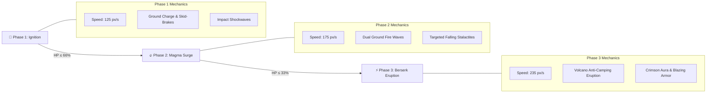

<div align="center">

# 🐾 PIXEL PALS: ADVENTURE RUN
### *A Fast-Paced Retro-Modern 16-Bit Platformer Engine*

[](https://pixelpals-game.vercel.app/)
[](https://www.typescriptlang.org/)
[](https://react.dev/)
[](https://vitejs.dev/)
[](https://vitest.dev/)
[](LICENSE)

<br/>

```text
 🦊 ─── 🐾 ─── 💎 ─── 🍄 ─── ❄️ ─── 🌋 ─── 👑
   JADE GROVE  •  SUNKEN GROTTO  •  EMBER DUNES  •  FROST PEAK  •  MAGMOR'S FORGE
```

**Zero external engines. Zero static audio files. 100% custom-crafted Canvas 2D delta physics and procedural Web Audio chiptune synthesis.**

[🕹️ Launch Game](https://pixelpals-game.vercel.app/) • [🦊 Hero Roster](#-playable-heroes) • [🗺️ 5 Worlds](#️-the-5-handcrafted-worlds) • [🔥 Boss Showdown](#-the-magmor-boss-showdown) • [🎵 Audio Synthesizer](#-procedural-chiptune-synthesizer) • [🕹️ Controls](#️-controls--input-ergonomics) • [🛡️ Strix Security](#️-defensive-engineering--strix-security) • [🛠️ Setup](#️-getting-started-locally)

---

</div>

<br/>

## ⚡ At A Glance

| Core Metric | Specification | Engineering Highlight |
| :--- | :--- | :--- |
| **Physics Engine** | Custom AABB Sub-Pixel Delta Stepping | 60/120 FPS buttery motion, coyote-time (120ms), jump buffering (100ms) |
| **Gaze Tracking** | Dynamic 360° Vector Tracking | Ember tracks cursor & touch drags; enemies track player position in real-time |
| **Audio Architecture** | 100% Procedural Web Audio API | Zero `.mp3`/`.wav` downloads; procedural oscillators (Square, Saw, Triangle, Noise) |
| **Roster** | 4 Distinct Animal Champions | Fox (Balanced), Bear (Fortitude), Frog (High Jump), Hare (Sonic Speed) |
| **World Progression** | 5 Handcrafted Realms + Boss Finale | Dynamic parallax layers, falling snow/ash particles, and hazard tiles |
| **Boss Battle** | Magmor the Ember King (3 Phases) | Skid-brakes, shockwaves, fire waves, stalactites, and berserk aura |
| **Testing & Security** | Vitest + Strix Defensive Standard | 23 unit tests, dual honeypots, rate limiting, and speed-trap defense |

<br/>

---

## 🌟 Overview

**Pixel Pals: Adventure Run** is a high-octane 2D animal platformer built from scratch in pure TypeScript and HTML5 Canvas. Paying homage to 16-bit classics (*Super Mario World*, *Sonic the Hedgehog*, and *Celeste*), the game bypasses third-party heavyweight engines like Phaser or PixiJS in favor of a lean, ultra-responsive native Canvas loop running at native monitor refresh rates.

From the rustling leaves of **Jade Grove** to the treacherous volcanic chambers of **Magmor's Forge**, players guide their chosen hero through secret brick caches, moving platforms, pipe chompers, and falling stalactites to restore peace to the realm.

<br/>

---

## 🦊 Playable Heroes

Every hero features custom physics constants, distinct gravity multipliers, bespoke eye geometry, and unique signature passive traits:

```text
       🦊 EMBER               🐻 BRAMBLE               🐸 PIP                 🐰 ZIP
   [Heart of Cinders]     [Grizzly Fortitude]    [Lilypad Spring]         [Sonic Sprint]
```

<br/>

### 1. 🦊 Ember the Fox — *The Balanced Trailblazer*
> *"No weaknesses, quick recovery, and all heart."*
- **Species**: Red Fox (`#ff8c3b` / `#fdf3e3`)
- **Passive Trait**: **Heart of Cinders** — Balanced acceleration and forgiving recovery curves.
- **Physics**: Speed: `372 px/s` • Jump Force: `585 px/s` • Friction: `2900 px/s²`
- **Stat Profile**:
  ```text
  Speed  : [██████░░░░] 60%
  Jump   : [██████░░░░] 60%
  Power  : [██████░░░░] 60%
  ```

### 2. 🐻 Bramble the Bear — *The Armored Juggernaut*
> *"A rolling boulder of fur. Starts with an extra heart."*
- **Species**: Grizzly Bear (`#a9744f` / `#ecd9bd`)
- **Passive Trait**: **Grizzly Fortitude** — Begins every world with **4 Hearts** instead of 3, plus immovable ground grip.
- **Physics**: Speed: `340 px/s` • Jump Force: `540 px/s` • Friction: `3400 px/s²`
- **Stat Profile**:
  ```text
  Speed  : [██████░░░░] 60%
  Jump   : [████░░░░░░] 40%
  Power  : [██████████] 100% (4 Lives)
  ```

### 3. 🐸 Pip the Frog — *The Aerial Acrobat*
> *"Springy legs built for floating over deep chasms."*
- **Species**: Tree Frog (`#5cc257` / `#e2f9d8`)
- **Passive Trait**: **Lilypad Spring** — Sky-high jump elevation and sustained mid-air hang time.
- **Physics**: Speed: `330 px/s` • Jump Force: `650 px/s` • Air Accel: `2100 px/s²`
- **Stat Profile**:
  ```text
  Speed  : [████░░░░░░] 40%
  Jump   : [██████████] 100%
  Power  : [████░░░░░░] 40%
  ```

### 4. 🐰 Zip the Hare — *The Lightning Speedster*
> *"Blink and you'll miss the golden blur."*
- **Species**: Wild Hare (`#ffd23f` / `#fff9e6`)
- **Passive Trait**: **Sonic Sprint** — Max sprint velocity for speedrunning world records.
- **Physics**: Speed: `445 px/s` • Jump Force: `595 px/s` • Accel: `2950 px/s²`
- **Stat Profile**:
  ```text
  Speed  : [██████████] 100%
  Jump   : [██████░░░░] 60%
  Power  : [████░░░░░░] 40%
  ```

<br/>

---

## 🗺️ The 5 Handcrafted Worlds

```text
[WORLD 1: Jade Grove] ──> [WORLD 2: Sunken Grotto] ──> [WORLD 3: Ember Dunes] ──> [WORLD 4: Frost Peak] ──> [WORLD 5: Magmor's Forge]
     🌿 Canopy Grass           💎 Cavern Crystals           🏜️ Molten Dunes             ❄️ Slippery Ice            🌋 The Ember King
```

<br/>

### 🌿 World 1: Jade Grove (*Whispering Canopy*)
* **Atmosphere**: Gentle emerald canopy, floating wooden bridges, sunny cloud parallax.
* **Hazards**: Patrol walkers, rolling acorn bouncers, introductory spike beds.
* **Chiptune Key**: C Major, 132 BPM, upbeat playful arpeggios.

### 💎 World 2: Sunken Grotto (*Luminous Depths*)
* **Atmosphere**: Deep bioluminescent caverns, glowing amethyst crystals, subterranean fog.
* **Hazards**: Vertical pipe chompers, collapsing stone ledges, moving crystal lifts.
* **Chiptune Key**: A Minor, 118 BPM, resonant echoes and triangle wave ambiance.

### 🏜️ World 3: Ember Dunes (*Molten Sands*)
* **Atmosphere**: Blazing crimson sunsets, heat haze ripples, ancient sandstone mesas.
* **Hazards**: Sinking quicksand, lava geysers, tracking desert spikers.
* **Chiptune Key**: D Minor, 140 BPM, driving bassline with fast staccato leads.

### ❄️ World 4: Frost Peak (*Glacial Spires*)
* **Atmosphere**: Sub-zero blizzards, dynamic snow particles, slippery glacial sheets.
* **Hazards**: Low friction ice physics, falling icicle stalactites, airborne dive predators.
* **Chiptune Key**: E Minor, 128 BPM, crystalline square high notes and sliding pitch bends.

### 🌋 World 5: Magmor's Forge (*The Crucible of Fire*)
* **Atmosphere**: Bubbling magma lakes, falling ember embers, screen-shaking volcanic tremors.
* **Hazards**: Sinking molten bridges, fire columns, anti-camping eruptions, and **Magmor**.
* **Chiptune Key**: C# Minor, 155 BPM, frantic boss percussion and intense harmonic minor riffs.

<br/>

---

## 🔥 The Magmor Boss Showdown

The climax of Pixel Pals features a battle against **Magmor, the Ember King** across 3 escalating phases:



<br/>

---

## 🕹️ Controls & Input Ergonomics

```text
 ┌────────────────────────────────────────────────────────────────────────────────────────┐
 │                                   KEYBOARD CONTROLS                                    │
 │                                                                                        │
 │         [ W / ↑ ]                    [ SPACE / Z ]                [ SHIFT / X ]        │
 │       (Look Upward)                  (Variable Jump)                 (Sprint)          │
 │                                                                                        │
 │   [ A / ← ]   [ D / → ]              [ S / ↓ ] + [ JUMP ]           [ ESC / P ]        │
 │    (Walk Left / Right)            (Drop Through Planks)             (Pause Menu)       │
 └────────────────────────────────────────────────────────────────────────────────────────┘
```

### 📱 Responsive Mobile Touch Deck
* **Left Thumb Zone**: Dual-button directional pad (`[ ◀ ]` and `[ ▶ ]`) with 48px ergonomic tap targets.
* **Right Thumb Zone**: Tactile **Jump** (`[ ▲ ]`) and high-speed **Run** (`[ ⚡ ]`) trigger buttons.
* **Adaptive Viewport**: Detects portrait orientation and guides players to rotate sideways into full widescreen arcade view.
* **Notch & Home Bar Protection**: Automatic `env(safe-area-inset-bottom)` and `env(safe-area-inset-left)` padding prevents accidental OS gesture triggers.

<br/>

---

## 🎵 Procedural Chiptune Synthesizer

Rather than downloading megabytes of static audio, Pixel Pals features a **pure Web Audio API synthesizer** (`src/game/audio.ts`) that calculates waveforms in real time:

```text
┌─────────────────┐      ┌─────────────────┐      ┌─────────────────┐      ┌─────────────┐
│ OscillatorNode  │ ───> │    GainNode     │ ───> │ DynamicsCompress│ ───> │ AudioContext│
│ (Square / Tri)  │      │ (ADSR Envelope) │      │  (Anti-Clipping)│      │ Destination │
└─────────────────┘      └─────────────────┘      └─────────────────┘      └─────────────┘
         ▲
┌─────────────────┐
│ AudioBufferNode │ (White Noise for Snare, Explosions & Dirt Puffs)
└─────────────────┘
```

* **Lead Melodies**: High-frequency **Square Waves** with snappy decay for crisp 8-bit leads.
* **Basslines**: Deep **Triangle Waves** simulating NES/GameBoy bass channels.
* **Percussion & Sound Effects**: Custom **White Noise Buffers** passed through band-pass filters for jump swooshes, coin chimes, stomps, and volcano eruptions.
* **Dynamic Chords**: Procedural polyphony with zero asset latency and microscopic bundle size.

<br/>

---

## 🛡️ Defensive Engineering & Strix Security

The in-game feedback and player interaction layer is fortified using the **Strix Security Methodology**:

* 🪤 **Dual Honeypot Protection**: Hidden decoy fields (`botcheck` and off-screen `_gotcha`) instantly intercept automated spam bots.
* ⏱️ **Speed-Trap Defense**: Reject or silently quarantine form submissions submitted in `< 1.8s` (impossible human reaction time).
* ⏳ **Rate Limiting & Cooldown**: 60-second client-side cooldown timer with live UI countdown preventing spam abuse.
* 🧹 **Input Sanitization & Length Bounds**: Strips dangerous HTML/script tags (`<[^>]*>?`), prevents prototype pollution keywords (`__proto__`, `constructor`), and enforces strict boundary caps.
* 🔒 **Zero Token Leaks**: No secret tokens, credentials, or keys exposed in client bundles.

<br/>

---

## 🏗️ Project Architecture

```text
Pixel-Pals-Adventure-Run/
├── src/
│   ├── components/
│   │   ├── GameCanvas.tsx          # 60 FPS Canvas loop, mobile touch deck, pause UI
│   │   └── FeedbackModal.tsx       # Strix-hardened player feedback modal
│   ├── game/
│   │   ├── engine.ts               # Core physics, AABB collisions, particle systems, boss AI
│   │   ├── characters.ts           # Hero definitions, stats, and color palettes
│   │   ├── levels.ts               # Tile grid maps, hazard placement, level builder DSL
│   │   └── audio.ts                # Real-time Web Audio API chiptune synthesizer
│   ├── lib/
│   │   └── security.ts             # Input sanitization, honeypot traps, and rate limiters
│   ├── App.tsx                     # Screen router (Title Screen, Hero Select, World Select)
│   ├── index.css                   # Tailwind v4 styles, CRT scanline overlay, pixel fonts
│   └── main.tsx                    # React DOM root mounting
├── tests/
│   └── unit/
│       ├── charactersAndLevels.test.ts # Hero stats and level layout assertions
│       ├── scoring.test.ts             # Score calculation & life counter tests
│       └── security.test.ts            # Strix security, honeypot & XSS filter tests
├── public/
│   └── favicon.svg                 # Pixel fox SVG icon
├── package.json
├── tsconfig.json
└── vite.config.js                  # Rollup manual chunking & production compiler
```

<br/>

---

## 🛠️ Getting Started Locally

### Prerequisites
* [Node.js](https://nodejs.org/) (v18.0.0 or higher recommended)
* `npm` (or `pnpm` / `yarn`)

### Installation & Run

```bash
# 1. Clone the repository
git clone https://github.com/codewithabhiishek/Pixel-Pals.git

# 2. Navigate to project directory
cd Pixel-Pals

# 3. Install dependencies
npm install

# 4. Launch local dev server with HMR
npm run dev
```

Visit `http://localhost:5173` in your browser to start playing!

### Verification & Testing Scripts

```bash
# Run the complete Vitest automated test suite (23 tests)
npm test

# Run TypeScript static type check
npm run typecheck

# Build the optimized production bundle
npm run build
```

<br/>

---

## 👨‍💻 Author

Crafted with ❤️ and ☕ by **Abhishek**

* 🌐 **Portfolio**: [abhiishek.is-a.dev](https://abhiishek.is-a.dev/)
* 🐙 **GitHub**: [@codewithabhiishek](https://github.com/codewithabhiishek)
* 🎨 **Project Gallery**: [Abhishek's Project Gallery](https://abhishek-project-gallery.vercel.app/)

<br/>

---

## 📜 License

This project is open-source and licensed under the [MIT License](LICENSE).
